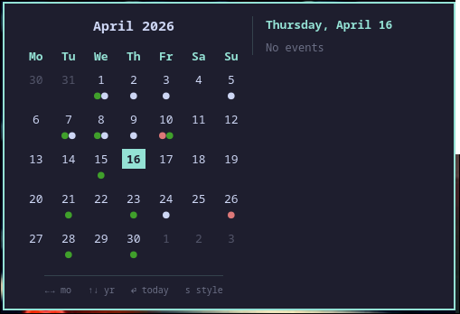

# waycal

A calendar popup for Waybar with Google Calendar integration. Click an icon in the bar to open a month view with your events — colored dots on days that have events, a live event list for the selected day, keyboard navigation, and a bar indicator showing today's event count.

Written in Rust with GTK4 and `gtk4-layer-shell`. Fully self-contained: one binary handles both the Waybar bar widget and the popup, with no Python, no shell scripts, and no external calendar daemons required.

<p align="center">
  
  &nbsp;&nbsp;
  
</p>

**With Google Calendar integration enabled:**

<p align="center">
  
</p>

## Features

- **Month view** with today highlighted, leading/trailing days dimmed
- **Google Calendar integration** — fetches events via OAuth2, caches per-month JSON locally (24h TTL), refreshes automatically
- **Event dots** on days that have events, colored per calendar
- **Day event panel** — click any day to see its events listed next to the calendar with time, icon, and title
- **Keyboard nav:** `←`/`→` month, `↑`/`↓` year, `Enter` today, `s` toggle style, `Esc` close
- **Two looks:** press `s` to swap between sharp-cornered and soft rounded style. Choice is remembered between launches
- **Waybar bar widget mode** (`--bar-output`) — prints today's event count as Waybar JSON; the count is shown in Catppuccin red when events exist
- **Position-aware anchoring** (`--anchor left|center|right`) — the popup opens at the correct corner of the screen depending on where the module lives in the bar
- **Dark theme** with sage-green accents, Pango markup for inline event colors — no external theme dependencies

## Requirements

waycal is a small native app, not a Waybar plugin. It runs on any Linux desktop that has:

- A **Wayland compositor supporting `wlr-layer-shell`**
  — Hyprland, Sway, river, Wayfire, Hikari, LabWC, etc. (not GNOME or KDE)
- **Waybar** (for the click-to-launch integration)
- **GTK4** and **gtk4-layer-shell** shared libraries
- A **Nerd Font** installed as a system font (CaskaydiaMono Nerd Font works out of the box)
- A **Google Cloud project** with the Calendar API enabled and a client secret JSON file (see [Google Calendar setup](#google-calendar-setup))

## Install

### Build from source

```sh
git clone <your-fork-url>
cd waycal
cargo build --release
install -Dm755 target/release/waycal ~/.local/bin/waycal
```

Dependencies needed to link (dev headers):

| Distro          | Install command                                                        |
| --------------- | ---------------------------------------------------------------------- |
| Arch            | `sudo pacman -S --needed gtk4 gtk4-layer-shell pkgconf`                |
| Fedora          | `sudo dnf install gtk4-devel gtk4-layer-shell-devel pkgconf`           |
| Debian / Ubuntu | `sudo apt install libgtk-4-dev libgtk4-layer-shell-dev pkg-config`     |

## Google Calendar setup

### 1. Create a Google Cloud project and credentials

1. Go to [Google Cloud Console](https://console.cloud.google.com/) → **New project**
2. Enable the **Google Calendar API** for the project
3. Go to **APIs & Services → Credentials → Create credentials → OAuth 2.0 Client ID**
4. Choose **Desktop app** as application type
5. Download the JSON file (this is your `credentials.json`)

### 2. Install credentials

```sh
mkdir -p ~/.config/waycal
cp /path/to/downloaded-credentials.json ~/.config/waycal/credentials.json
```

### 3. Authorize waycal

Run the bar-output command once to trigger the OAuth flow:

```sh
waycal --bar-output
```

It will print an authorization URL to stderr. Open it in your browser, click **Allow**, then paste the authorization code that Google gives you back into the terminal. The token is saved to `~/.cache/waycal/token.json` and refreshed automatically on future runs.

## Waybar integration

### Bar widget (event count)

Add a custom module to your `~/.config/waybar/config.jsonc`:

```jsonc
"custom/calendar": {
  "exec": "waycal --bar-output",
  "return-type": "json",
  "interval": 60,
  "on-click": "~/.config/waybar/scripts/toggle_calendar.sh"
}
```

Reference it in one of your `modules-*` lists:

```jsonc
"modules-right": ["custom/calendar", "clock"]
```

### Toggle script

Create `~/.config/waybar/scripts/toggle_calendar.sh` with the content below. The script kills waycal if it's already open (toggle), then reads your waybar config to detect whether the module is in the left, center, or right section and passes the correct `--anchor` so the popup appears at the right corner of the screen.

```bash
#!/usr/bin/env bash
pkill -x waycal && exit 0

CONFIG="${XDG_CONFIG_HOME:-$HOME/.config}/waybar/config.jsonc"

ANCHOR=$(python3 - "$CONFIG" <<'EOF'
import json, re, sys
try:
    with open(sys.argv[1]) as f:
        txt = re.sub(r'//[^\n]*', '', f.read())
    data = json.loads(txt)
except Exception:
    print('center'); sys.exit(0)
configs = data if isinstance(data, list) else [data]
for cfg in configs:
    if 'custom/calendar' in cfg.get('modules-right', []):
        print('right'); sys.exit(0)
    if 'custom/calendar' in cfg.get('modules-center', []):
        print('center'); sys.exit(0)
    if 'custom/calendar' in cfg.get('modules-left', []):
        print('left'); sys.exit(0)
print('center')
EOF
)

exec waycal --anchor "${ANCHOR:-center}"
```

Make it executable:

```sh
chmod +x ~/.config/waybar/scripts/toggle_calendar.sh
```

Restart Waybar (`pkill -x waybar && setsid waybar &`) and click the icon.

## Controls

| Key         | Action                                   |
| ----------- | ---------------------------------------- |
| `←` / `→`   | Previous / next month                    |
| `↑` / `↓`   | Previous / next year                     |
| `Enter`     | Jump back to today                       |
| `s`         | Toggle sharp / rounded style (persisted) |
| `Esc`       | Close the popup                          |
| Click a day | Show that day's events in the side panel |

## CLI flags

| Flag                    | Description                                               |
| ----------------------- | --------------------------------------------------------- |
| `--bar-output`          | Print today's event count as Waybar JSON, then exit       |
| `--anchor left\|center\|right` | Anchor the popup to the left, center, or right of the screen (default: `center`) |

## Configuration

waycal reads `~/.config/waycal/config` on startup and writes a commented default on first run. All keys are optional — omit any section or key to keep the built-in defaults.

```ini
# ~/.config/waycal/config

[theme]
preset = catppuccin-mocha   # default | catppuccin-mocha | catppuccin-latte |
                             # tokyonight-storm | gruvbox | dracula
# Individual keys override the preset:
# accent          = #94e2d5
# background      = #1e1e2e
# text            = #cdd6f4
# text_muted      = #6c7086
# bar_count_color = #f38ba8
# font_family     = CaskaydiaMono Nerd Font, monospace
# font_size       = 13

# Google Calendar integration — false by default (plain calendar mode)
[gcal]
enabled = true

# Fallback for unrecognized calendars
[default]
color = #cdd6f4
icon  = 󰒆

# One section per Google Calendar (name must match exactly)
[calendar "Personal"]
color = #dd7878
icon  = 󰋚

[calendar "Work"]
color = #89b4fa
icon  = 󰃭
```

A fully commented `config.example` is included in the repo root.

### Theme presets

| Preset              | Background | Accent    |
| ------------------- | ---------- | --------- |
| `default`           | `#1a2125`  | `#8FBC8F` |
| `catppuccin-mocha`  | `#1e1e2e`  | `#a6e3a1` |
| `catppuccin-latte`  | `#eff1f5`  | `#40a02b` |
| `tokyonight-storm`  | `#24283b`  | `#7aa2f7` |
| `gruvbox`           | `#282828`  | `#8ec07c` |
| `dracula`           | `#282a36`  | `#50fa7b` |

## File locations

| Path                                         | Purpose                                   |
| -------------------------------------------- | ----------------------------------------- |
| `~/.config/waycal/config`                    | Theme, calendar colors, gcal toggle       |
| `~/.config/waycal/credentials.json`          | Google OAuth2 client secret (you provide) |
| `~/.cache/waycal/token.json`                 | OAuth2 access + refresh token (auto-managed) |
| `~/.cache/waycal/events_YYYY-MM.json`        | Per-month event cache (24h TTL)           |
| `~/.local/state/waycal/style`                | Persisted sharp/rounded style preference  |

## Why not just use the Waybar clock tooltip?

The built-in `clock` tooltip shows a calendar, but it's an HTML label tooltip — not focusable, not keyboard-navigable, and shares the clock module's click action. waycal is a real window you can interact with, and leaves your clock's click behavior untouched.

## Fork notes

This fork adds the following on top of the original waycal:

- **Google Calendar integration** — OAuth2 token management, per-month event cache (24h TTL), colored event dots per day, selected-day event panel with time + icon + title
- **Bar widget mode** (`--bar-output`) — outputs Waybar JSON with today's event count; the count is colored via `bar_count_color` in the theme
- **Position-aware anchoring** (`--anchor left|center|right`) — popup opens at the correct screen corner based on where the Waybar module lives
- **Themeable config** (`~/.config/waycal/config`) — INI-style config with 5 built-in presets, per-calendar icon/color overrides, and a `[gcal] enabled` toggle to switch between plain and Google Calendar mode
- **`[gcal] enabled` toggle** — when `false` (default), waycal runs as the original plain calendar with no Google Calendar dependency; set to `true` to enable event fetching

All additions were implemented with [Claude Code](https://claude.ai/code) using the Claude Sonnet 4.6 model.

## License

MIT.
